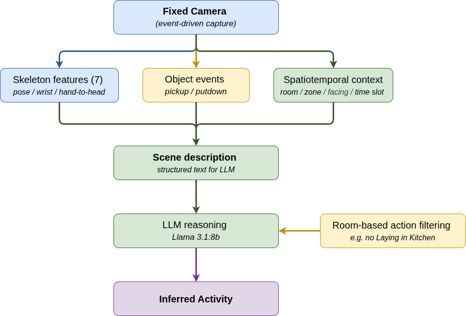
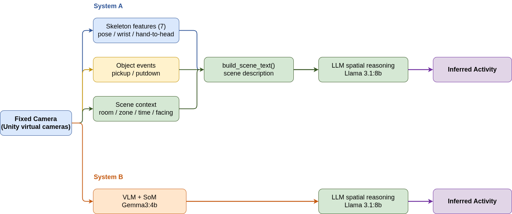
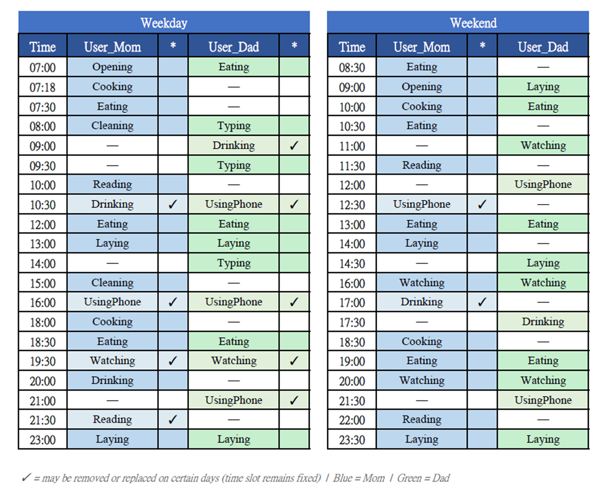
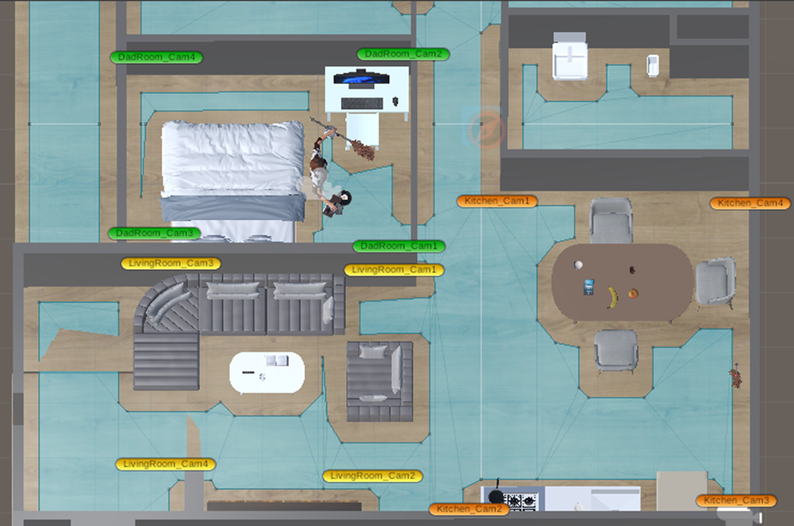
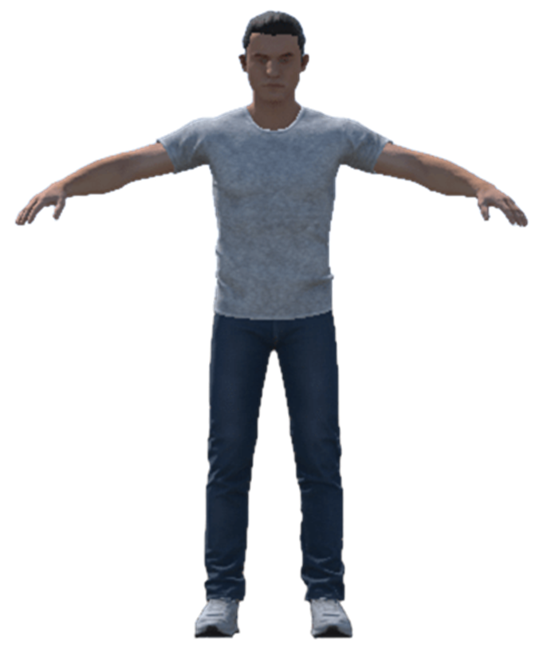
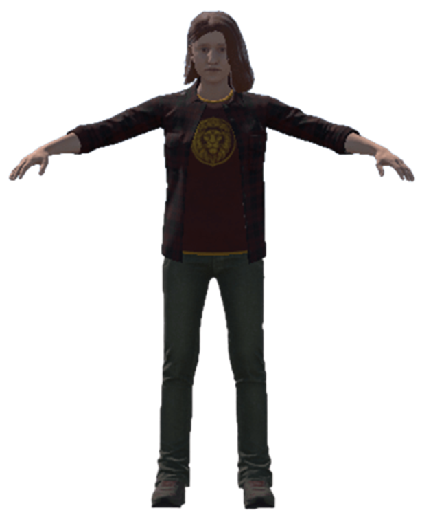
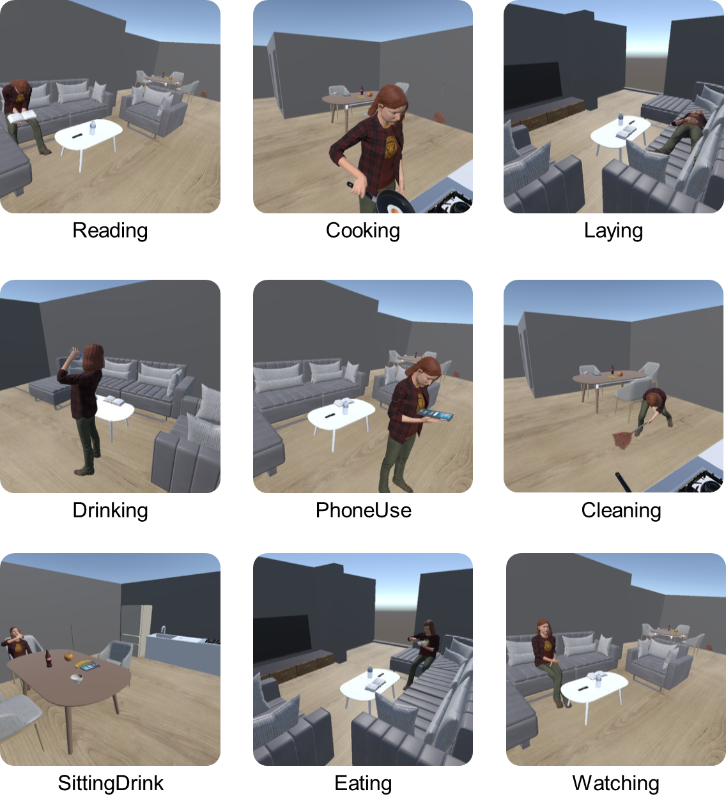
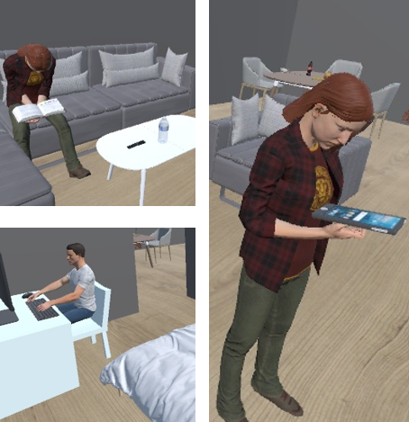
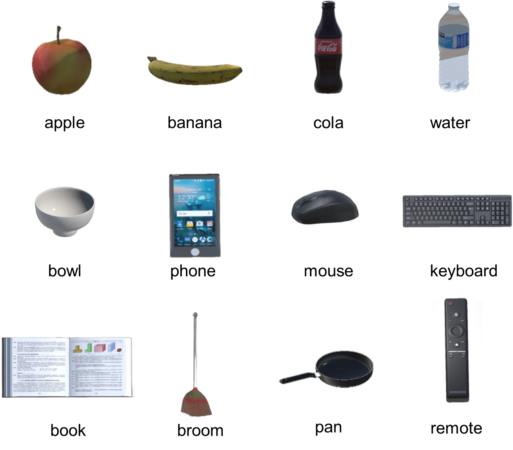

# Personalized Home Service Agent — Unity Simulation Environment

**A controllable, repeatable Unity 3D testbed for validating a fixed-camera, LLM-driven home service agent.**

> Simulation client of a Master's thesis project: *Personalized Home Service Agent Based on Spatiotemporal Behavioral Reasoning via Multi-Camera Observation*, Dept. of Computer Science and Information Engineering, National Cheng Kung University.
> Backend / LLM reasoning engine (companion repo): **[pythonBackend3](https://github.com/wenny2377/pythonBackend3)**
> Demo video (Unity simulation only): **[YouTube](https://youtu.be/q-vv0kFVluc?si=qToAYmvG8ehh1d5i)**

---

## What this is

This Unity project is the data-generation and experiment-control side of a home-service-robot research system. It simulates two virtual residents living out fixed daily routines in a small apartment, captured entirely by **fixed, event-driven cameras** (no robot-mounted camera, no physical sensors) — and streams everything the [Python backend](https://github.com/wenny2377/pythonBackend3) needs over HTTP: images, skeleton features, object pickup/putdown events, positions, and device states.

The reason for building a simulator instead of testing directly on real hardware: it provides exact ground truth for every recognized activity, and lets the same 7-day behavioral script be re-run identically under different sensor-noise conditions — which is what makes the accompanying ablation and robustness experiments possible.

---

## Environment

- **3 rooms**: Kitchen, Living Room, Bedroom
- **12 fixed camera nodes** (4 per room), each scored per-frame on facing alignment, visibility (raycast), and distance to select the best 2 viewpoints for each capture
- **2 virtual residents** (`User_Mom`, `User_Dad`) with deliberately different behavioral profiles (household routine vs. office-hours pattern) — used later to validate that the backend's behavior-pattern learning can tell them apart from observation alone
- **12 interactable objects** across 4 categories (beverages, food, electronics, daily items)
- **Event-driven capture**: cameras only trigger when a user is detected as still for a set duration, not continuous streaming

## What gets sent to the backend

Three complementary information sources are captured at each event-driven trigger and streamed to the [Python backend](https://github.com/wenny2377/pythonBackend3), where they are fused into a single scene description for LLM reasoning:

| Endpoint | Purpose |
|---|---|
| `/predict` | Full capture bundle at trigger time: images, skeleton features, position/orientation, ground-truth activity label |
| `/dynamic_sync` | Periodic sync of user and object positions/holding state |
| `/scene` | One-time static furniture map at startup |
| `/object_event` | Real-time pickup/putdown events |

## Experiment support

The simulation runner supports multiple experiment conditions from the same fixed 7-day behavioral schedule:

- **Baseline** — no injected noise
- **VLM comparison mode** — same scenario, evaluated by a vision-only model instead of the structured pipeline
- **Corruption (Light / Medium / Heavy)** — synthetic sensor noise for robustness testing: pickup/putdown event dropout, object-label confusion, Gaussian skeleton noise

Day-to-day variation in the schedule is deterministic (specific actions are removed/replaced on specific days), not random — this keeps every experiment condition directly comparable.

This simulator also feeds a **VLM-only comparison system** used to evaluate structured reasoning against pure image-based inference — both systems consume the exact same fixed-camera captures:

The two residents follow fixed, deterministic weekday/weekend schedules (with a few actions removed/replaced on specific days for variation — see checkmarks below):

---

## Screenshots

### Scene layout & camera placement

Top-down view of the apartment with all 12 fixed camera nodes labeled (4 per room):

### Virtual residents

Two virtual residents with distinct appearances and behavioral profiles:

| User_Dad | User_Mom |
|---|---|
|  |  |

### Activity gallery

A sample of the 10 recognized daily activities as captured by the fixed cameras:

### Interactable objects

12 interactable objects across 4 categories (beverages, food, electronics, daily items):

---

## Tech Stack

- Unity 2022.3 LTS, C#
- NavMesh-driven agent movement, Humanoid Animator skeleton rig
- HTTP REST communication with the Python backend

---

## Related work

- Backend / LLM reasoning engine: **[pythonBackend3](https://github.com/wenny2377/pythonBackend3)**
- Demo video (Unity simulation only): **[YouTube](https://youtu.be/q-vv0kFVluc?si=qToAYmvG8ehh1d5i)**

